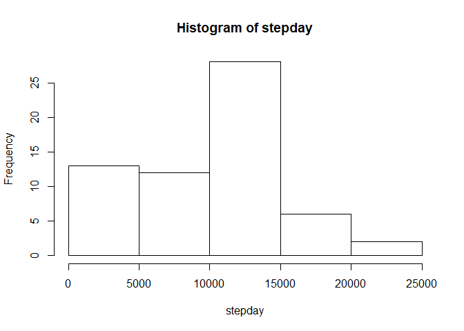

# Activity Monitoring Data Analysis


##Loading and preprocessing the data


```r
#load data
data<-read.csv("activity.csv", header = TRUE, sep = ",", na.strings = "NA", stringsAsFactors = FALSE)

#date column convert to date type
data$datef<-as.Date(data$date)
summary(data)
```

```
##      steps            date              interval          datef           
##  Min.   :  0.00   Length:17568       Min.   :   0.0   Min.   :2012-10-01  
##  1st Qu.:  0.00   Class :character   1st Qu.: 588.8   1st Qu.:2012-10-16  
##  Median :  0.00   Mode  :character   Median :1177.5   Median :2012-10-31  
##  Mean   : 37.38                      Mean   :1177.5   Mean   :2012-10-31  
##  3rd Qu.: 12.00                      3rd Qu.:1766.2   3rd Qu.:2012-11-15  
##  Max.   :806.00                      Max.   :2355.0   Max.   :2012-11-30  
##  NA's   :2304
```


##What is mean total number of steps taken per day?


```r
#total steps by day
stepday<-with(data, tapply(steps, datef, sum, na.rm=TRUE))
hist(stepday)
```

<!-- -->

```r
#mean of total steps by day
mean(stepday)
```

```
## [1] 9354.23
```

```r
#median of total steps by day
median(stepday)
```

```
## [1] 10395
```

##What is the average daily activity pattern?


```r
#for each interval, average number of steps taken, averaged across all days 
stepinterval<-with(data, tapply(steps, interval, mean, na.rm=TRUE))

#Make a time series plot (type = "l") of the 5-minute interval (x-axis) and the average number of steps taken, averaged across all days (y-axis)
plot(stepinterval, type = 'l', xlab = "5-minute interval", ylab = "average number of steps taken")
```

<!-- -->

```r
#Which 5-minute interval, on average across all the days in the dataset, contains the maximum number of steps?
which(stepinterval == max(stepinterval), arr.ind = T)
```

```
##     dim1
## 835  104
```

##Imputing missing values. 


```r
#Calculate and report the total number of missing values in the dataset (i.e. the total number of rows with NAs)
summary(data$steps=="NA")
```

```
##    Mode   FALSE    NA's 
## logical   15264    2304
```

```r
#Devise a strategy for filling in all of the missing values in the dataset. The strategy to use the mean for that 5-minute interval.
stepintervalf<-as.data.frame.table(stepinterval)
names(stepintervalf)<-c("interval", "mean")

#Create a new dataset that is equal to the original dataset but with the missing data filled in.
newdata<-data
for (i in 1:nrow(newdata)) {
  if (is.na(newdata$steps[i]))  {
    newdata$steps[i] = stepintervalf[which(newdata$interval[i]==stepintervalf$interval), ]$mean
      }
}

#total number of steps taken each day 
newstepday<-with(newdata, tapply(steps, datef, sum, na.rm=TRUE))

hist(newstepday)
```

<!-- -->

```r
mean(newstepday)
```

```
## [1] 10766.19
```

```r
median(newstepday)
```

```
## [1] 10766.19
```

Do these values differ from the estimates from the first part of the assignment?   YES.  
What is the impact of imputing missing data on the estimates of the total daily number of steps?  
It increased the total daily number of steps on some days. For example, 10/01 before 0 after 10766.


##Are there differences in activity patterns between weekdays and weekends?


```r
#Create a new factor variable in the dataset with two levels - "weekday" and "weekend" indicating whether a given date is a weekday or weekend day.

newdata$day<-ifelse(weekdays(newdata$datef) == "Saturday" | weekdays(newdata$datef) == "Sunday", "Weekend", "Weekday")
newdata$day <- factor(newdata$day)


#Make a panel plot containing a time series plot (type = "l") of the 5-minute interval (x-axis) and the average number of steps taken, averaged across all weekday days or weekend days (y-axis). 

newstepinterval<-aggregate(steps ~ interval + day, data = newdata, mean)

library(ggplot2)
ggplot(newstepinterval, aes(interval, steps))+geom_line()+facet_grid(day~.) +xlab("5-minute interval")+ylab("average number of steps taken")
```

<!-- -->


